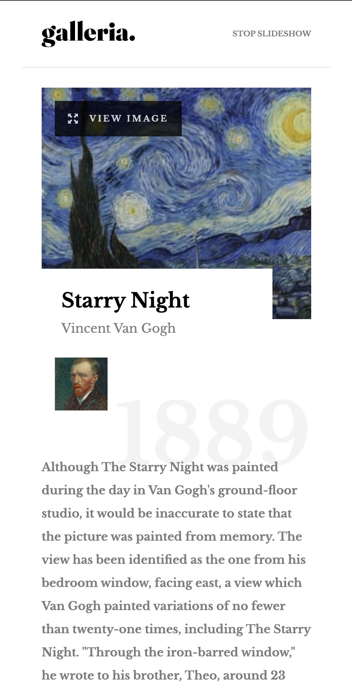
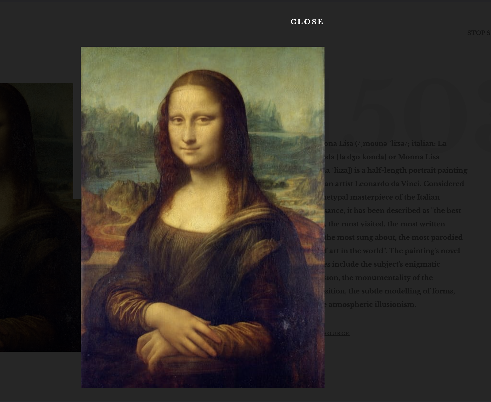

# Frontend Mentor - Galleria slideshow site solution

This is my solution to the [Galleria slideshow site challenge on Frontend Mentor](https://www.frontendmentor.io/challenges/galleria-slideshow-site-tEA4pwsa6). Frontend Mentor challenges help you improve your coding skills by building realistic projects.

## Table of contents

- [Overview](#overview)
  - [The challenge](#the-challenge)
  - [Screenshot](#screenshot)
  - [Links](#links)
- [My process](#my-process)
  - [Built with](#built-with)
- [Author](#author)

## Overview

### The challenge

Users should be able to:

- View the optimal layout for the app depending on their device's screen size
- See hover states for all interactive elements on the page
- Navigate the slideshow and view each painting in a lightbox

### Screenshot

#### mb view

#### full view

#### lightbox

### Links

- Solution URL: [solution](https://github.com/roodhouse/frontend-mentor-galleria)
- Live Site URL: [live site](https://galleria.rugh.us)

## My process

### Built with

- HTML5, CSS
- Mobile-first workflow
- React
- Tailwind

## Author

- Website - [my site](https://rugh.us)
- Frontend Mentor - [@roodhouse](https://www.frontendmentor.io/profile/roodhouse)
- LinkedIn - [John Rugh](https://www.linkedin.com/in/john-m-rugh/)
